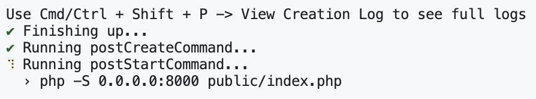
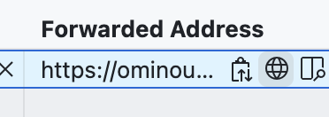

## Portfolio

Dit is de repository waarmee je je porfolio kunt opbouwen. Fork deze repository, en dan kun je een codespace maken waarmee je aan de slag kunt.

Mocht je dit hieronder zien:

Dan zit je goed en kun je aan de slag. Ga dan naar ports, hover over de link en klik op het bolletje om de site te zien: 

